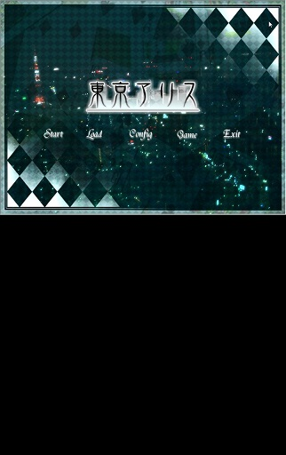
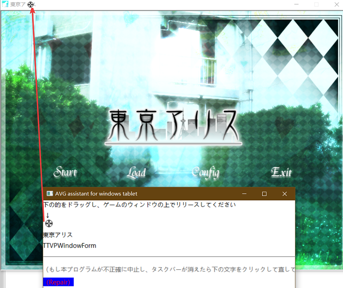

AVG assistant for windows tablet
==========
> windows 8のタブレットでAVGゲームをプレイする時、full screen機能を補足するプログラムです。

現在、数多のAVGゲームのfull screen機能は、タブレットの垂直スクリーン状態で正確に動作できません。例えば下の画像に示しているように

本プログラムを使ったら、下記の画像のように、ドラッグ＆ドロップだけで、ゲームスペリエンスを高めることができます。

最後に、ゲームの画面が下のように変換します。左上と右下にゲームをコントロールする必要な機能がついています。

## 問題点
DirectXで作ったゲームでは、簡単にゲームウィンドウのtitlebarとかを消すことができませんので、新たな方法が必要。

ここで、windows開発の上級手法*API hook*を使うのがいいと思います。

詳しい方法は私の[GameWindowAPIhooker](https://github.com/tanghaowen/GameWindowAPIhooker)を見てください
